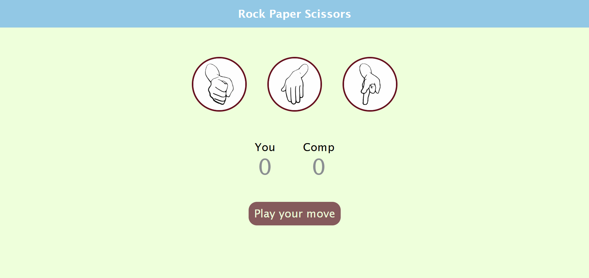
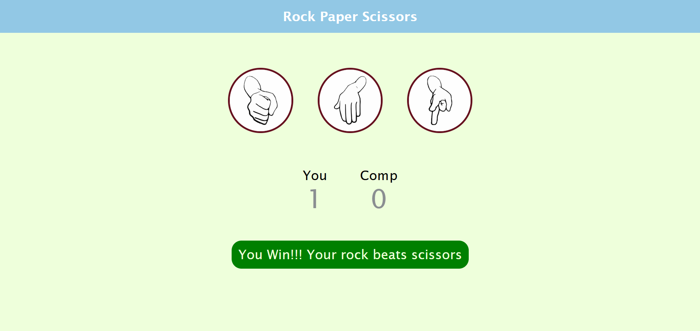
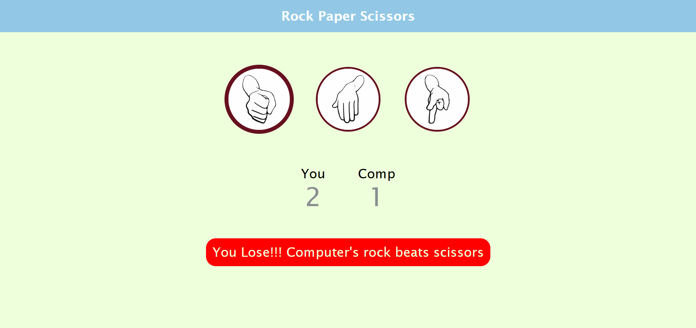

# 🕹️ Rock Paper Scissors Game  

A simple, interactive **Rock Paper Scissors** game built using **HTML**, **CSS**, and **JavaScript**.  

---

## 🎮 Features  
- **Three Choices**: Select between rock, paper, and scissors.  
- **Dynamic Gameplay**: Computer randomly generates its choice for each round.  
- **Score Tracking**: Live updates for user and computer scores.  
- **Result Display**: Clear messages for wins, losses, and draws.  

---

## 📸 Screenshots  
### Game Interface  
  

### Gameplay Example  
 
 

---

## 📧 Contact
Feel free to reach out if you have any questions or suggestions!  
**Email**: [nishantsinha.referral@gmail.com](mailto:nishantsinha.referral@gmail.com)  
**GitHub**: [sinha001](https://github.com/sinha001)

---

## 🚀 How to Run  
1. Clone this repository:  
   ```bash
   git clone https://github.com/sinha001/JavaScript-Journey.git
